# Práctica 1 (Spring Boot): Instalación, Configuración Inicial y Primer Endpoint

### Carolina Fortmann

## Evidencias de la práctica 01

#### 1.- Verificación de Java:

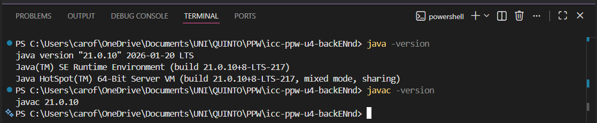

#### 2.- Servidor Spring Boot ejecutándose:

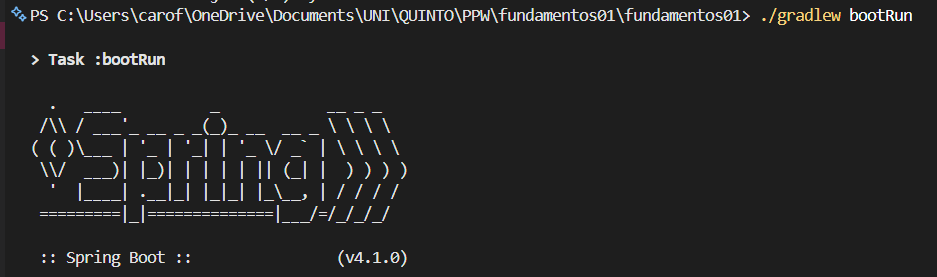

#### 3.- Endpoint /api/status funcionando en el navegador:

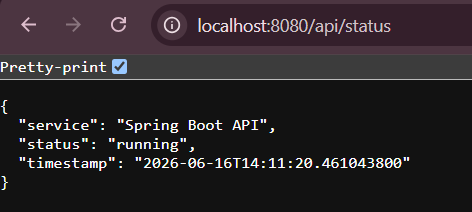

#### 4.- Comando de verifiación de archivo:

```ls ./src/main/java/ec/edu/ups/icc/fundamentos01/controllers/```

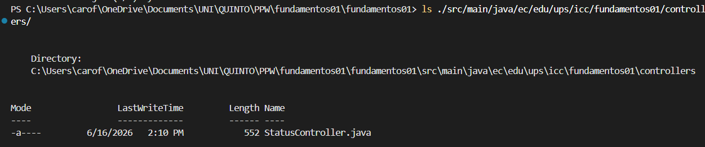

#### 5.- Responder:

- **¿Qué entendió sobre el funcionamiento del endpoint?**  

El EndPoint funciona como una puerta de enlace cuando se entra a la URL, el servidor recibe una petición GET, activando el método dentro del controlador gracias a ``@RestController`` y ``@GetMapping``.  Luego devuelve de manera automática un objeto JSON.

- **La función general de Spring Boot en la creación del servidor**

La función principal es crear un Backend más sencillo sin necesidad de instalar un servidor aparte. Esto permite que la aplicación sea autónoma, configure todo lo necesario de manera interna y arranque el servidor web con un solo comando.

# Práctica 3: API Rest
## Capturas 18/06

#### 1.- Localhost del nuevo recurso Students:

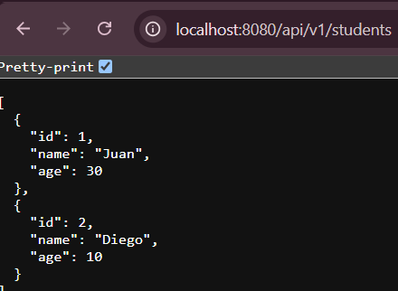

#### 2.- Students/count:

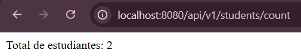


# Práctica 5 (Spring Boot): Persistencia real con PostgreSQL, Entidades JPA y Repositorios

## Evidencias:

#### 1.- Aplicación Docker Desktop:

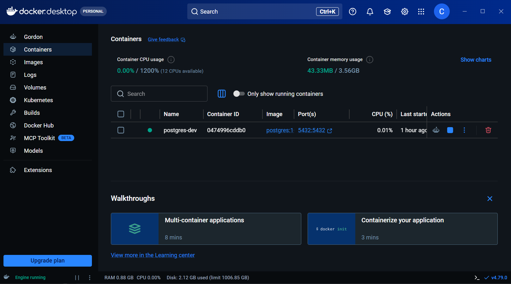

#### 2.- Verificación en PostgreSQL:

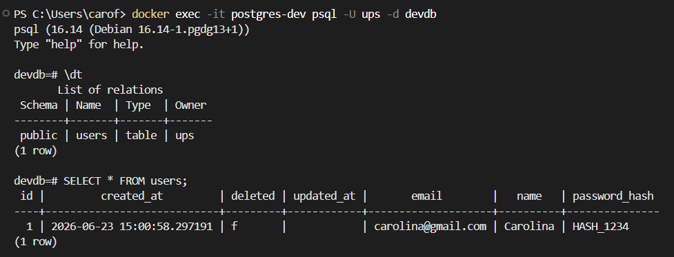

### Creación de clases en ```\products```:

## Evidencias:

#### 1.- Visualización de los 5 productos:

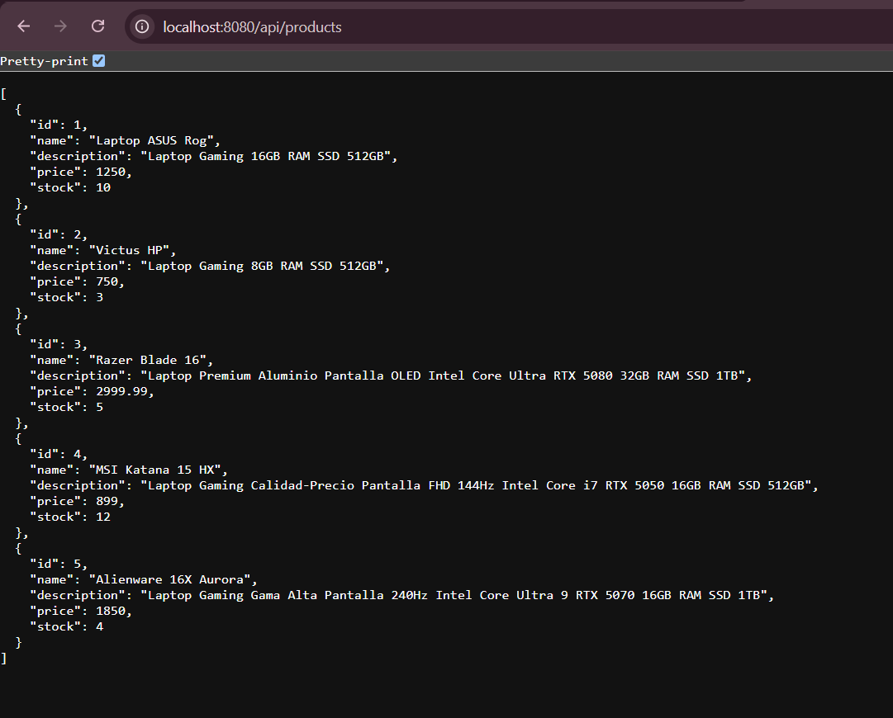

**Descripción:** Se insertaron (PUT) 5 registros de productos a través de BRUNO.

#### 2.- Verificación en PostgreSQL:

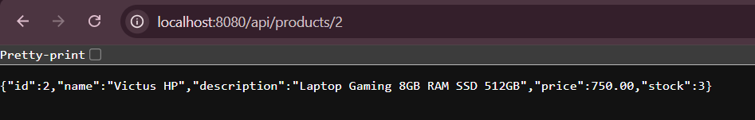


#### 3.- Verificación en PostgreSQL:

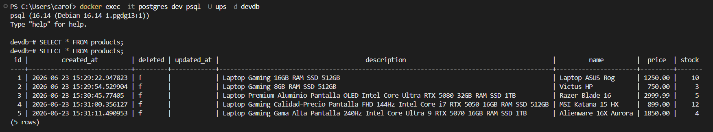


#### 4.- Explicar el flujo:

**Desde API REST hacia PostgreSQL:**

- El cliente realiza una petición HTTP enviando un JSON, el ProductsController recibe un objeto de transferencia de datos (CreateProductDto). Este DTO se pasa al ProductServiceImpl, cual utiliza el componente ProductMapper para convertir los datos de entrada al ProductModel y luego a ProductEntity. El servicio invoca al método ```.save()``` de ProductRepository, lo que hace que Hibernate traduzca la entidad en una sentencia SQL INSERT que se ejecuta en el contenedor de PostgreSQL. Durante este guardado, los interceptores de la clase abstracta BaseEntity (como ```@PrePersist```) se encargan de asignar automáticamente los valores de auditoría, como la fecha de creación en createdAt y el estado lógico de eliminación.

**De PostgreSQL hacia la API REST:**

- Tras la inserción, PostgreSQL genera el IDENTITY. Hibernate mapea este registro resultante de vuelta a un objeto ProductEntity. El flujo regresa a la capa de servicio, donde se vuelve a pasar por el ProductMapper para transformar la entidad en un ProductResponseDto. Este DTO final es el que retorna el controlador al cliente en formato JSON, consumiendo las propiedades internas de la base de datos y mostrando solo la información requerida.


# Práctica 6 (Spring Boot): Validación de DTOs y Control de Datos de Entrada

## Evidencias:

#### 1.- Validación POST:

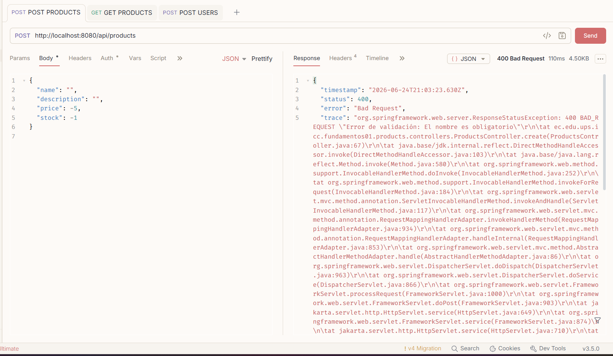

#### 2.- Validación PATCH:

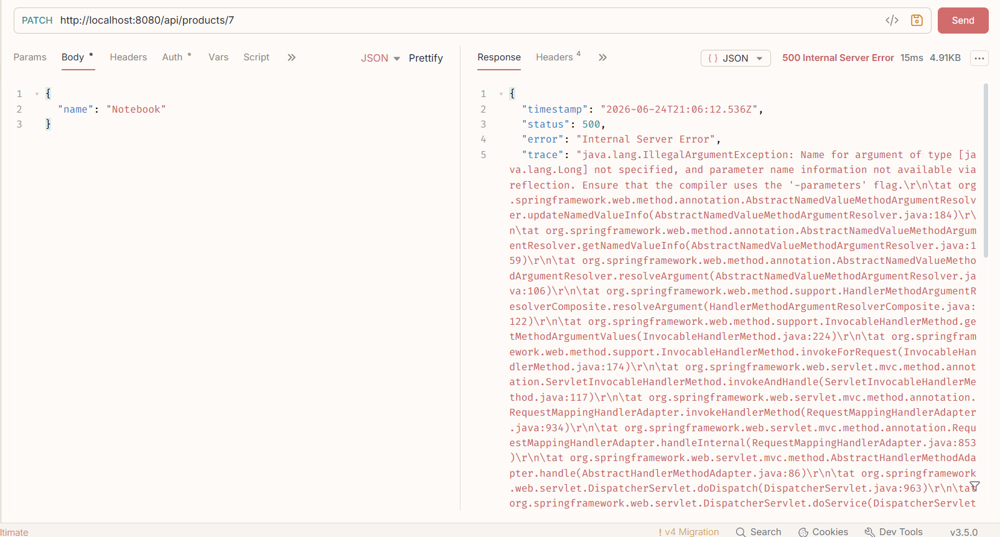


# Práctica 8 (Spring Boot): Relaciones ManyToOne, Foreign Keys y Consultas Relacionales

## Captura:

#### 1.- Consulta de productos por categoría:

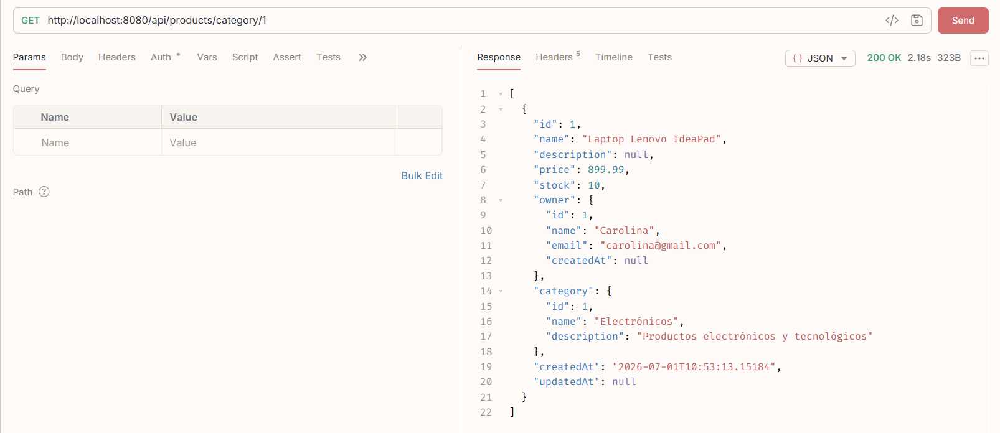

#### 2.- Responder:

**¿Cómo se relaciona ProductEntity con UserEntity y CategoryEntity usando @ManyToOne y @JoinColumn?**

Estas anotaciones se implementan en la clase ```ProductEntity```:

```java
@ManyToOne(optional = false, fetch = FetchType.LAZY)
@JoinColumn(name = "user_id", nullable = false)
private UserEntity owner;
```

- ```@ManyToOne``` significa que muchos productos pueden pertenecer a un mismo usuario. Con **optional = false** indicamos que el producto no puede existir con esta relación. También utiliza el fetch type **LAZY** el cual  indica que la entidad relacionada se carga solo cuando se accede a ella.

- ```@JoinColumn(name = "user_id")``` crea la columna de la clave foránea **user_id** en la tabla products. Con **nullable = false** nos aseguramos que este campo sea obligatorio.

En resumen, usando ```@ManyToOne``` y ```@JoinColumn``` cada registro de products almacena las claves foráneas **user_id** y **category_id**, creando la relación entre un producto, su propietario y su categoría, mientras que un mismo usuario o una misma categoría pueden estar asociados a varios productos.


# Práctica 9 (Spring Boot): Request Parameters, Consultas Relacionadas y Filtrado con JPA

## Capturas:

#### 1.- Consulta con filtros por usuario:

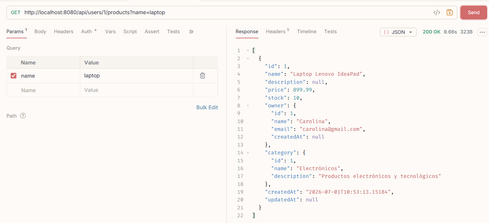

#### 2.- Consulta con filtros por precios:

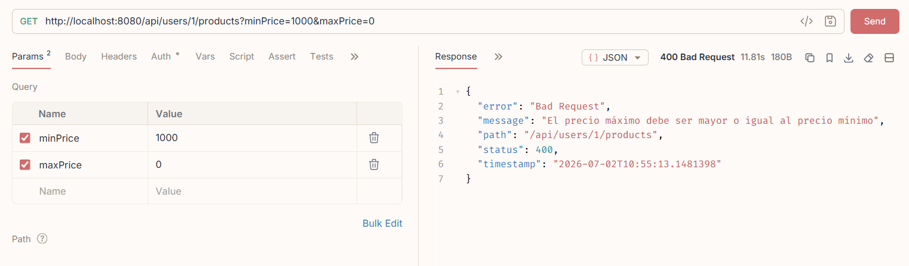

#### 3.- Responder:

**¿Por qué se usa ProductService y ProductRepository para consultar productos aunque el endpoint esté dentro del contexto /users/{id}/products o /categories/{id}/products?**

Porque en sí el recurso que se está utilizando es Productos, no los datos de Usuarios o Categorías. Toda la lógica de negocio recae en las clases de Productos. Con ProductRepository podemos realizar una consulta explícita sin tener que, por ejemplo a través de Usuarios realizar filtrados para llegar a Productos.

**¿Qué cambió al pasar de Product N ── 1 Category a Product N ── N Category?**

Su relación pasa a ser ```@ManyToMany```, lo que significa que ambas entidades estan relacionadas entre sí en una tabla a parte, ya no en un atributo dentro de Productos. Ahora las categorías se manejan dentro de una colección.